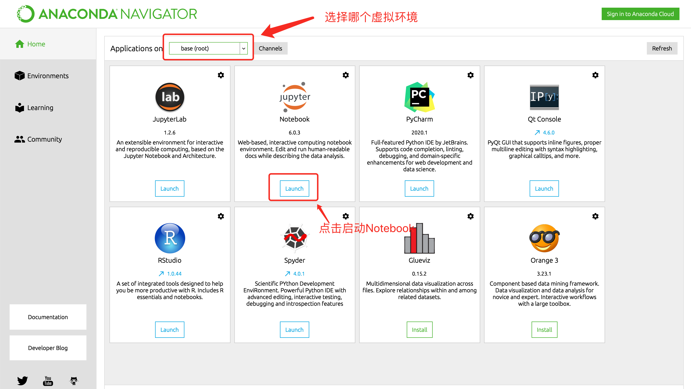
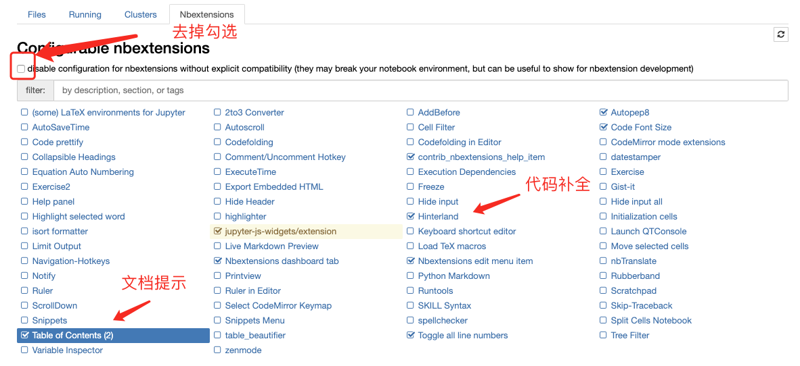
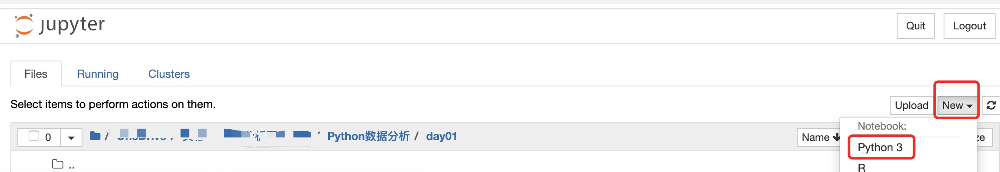
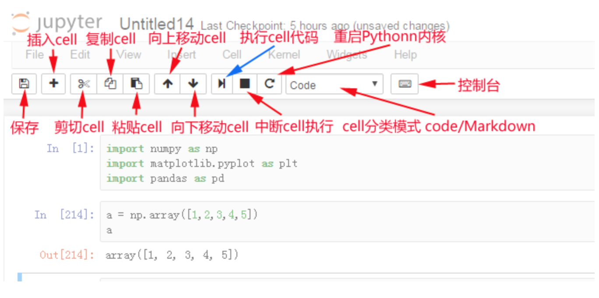
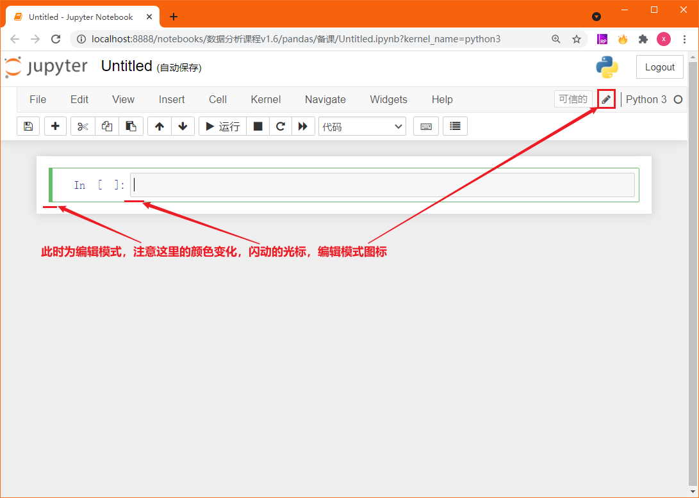
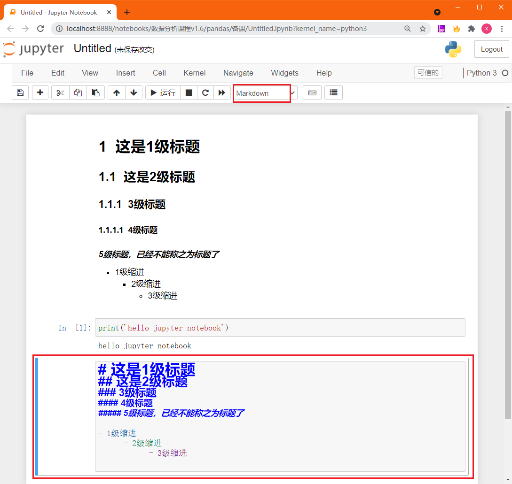

# 项目介绍

美国外交事务后台

# 项目安装

```shell
pip install -i https://pypi.tuna.tsinghua.edu.cn/simple some-package
pip install -i https://mirrors.aliyun.com/pypi/simple/
conda create --name USForeignAffairServerSide python==3.6.7
conda install flask==1.0.2
conda install pymysql
pip install flask_sqlalchemy
pip install flask_restful
pip install flask-cors
pip install jupyterbook
pip install -i https://pypi.tuna.tsinghua.edu.cn/simple jupyter_contrib_nbextensions
jupyter contrib nbextension install --user --skip-running-check
```

# 项目配置

首先需要配置以下环境变量

```python
FLASK_APP=run.py
FLASK_ENV=development # 配置FLASK环境，默认为production
FLASK_DEBUG=1  # 是否开启debug模式如果不需要开启则填写0
PROJECT_SETTING=setting.py

```

# 项目运行

启动项目

```shell
flask run -h 127.0.0.1 -p 5000
```

不同位置的参数都存放在Flask包中request对象的不同属性中


| 属性    | 说明                           | 类型           |
| ------- | ------------------------------ | -------------- |
| data    | 记录请求的数据，并转换为字符串 | \*             |
| form    | 记录请求中的表单数据           | MultiDict      |
| args    | 记录请求中的查询参数           | MultiDict      |
| cookies | 记录请求中的cookie信息         | Dict           |
| headers | 记录请求中的报文头             | EnvironHeaders |
| method  | 记录请求使用的HTTP方法         | GET/POST       |
| url     | 记录请求的URL地址              | string         |
| files   | 记录请求上传的文件             | \*             |


# 其他说明

## 1. Jupyter Notebook的使用

### 1.1 Jupyter notebook的功能扩展

1）在启动Anaconda提供的CMD后，安装jupyter_contrib_nbextensions库，在CMD中输入下列命令

```bash
# 进入到虚拟环境中
conda activate 虚拟环境名字
# 安装 jupyter_contrib_nbextensions
pip install jupyter_contrib_nbextensions
# jupyter notebook安装插件
jupyter contrib nbextension install --user --skip-running-check
```

2）安装结束后启动jupyter notebook



3）配置扩展功能，在原来的基础上勾选： "Table of Contents" 以及 "Hinterland"



### 1.2 Jupyter Notebook的界面

1）新建notebook文档

> 注意：Jupyter Notebook 文档的扩展名为`.ipynb`，与我们正常熟知的`.py`后缀不同



2）新建文件之后会打开Notebook界面


3）菜单栏中相关按钮功能介绍

> 注意：Jupyter Notebook的代码的输入框和输出显示的结果都称之为cell，cell行号前的 * ，表示代码正在运行



### 1.3  Jupyter Notebook常用快捷键

Jupyter Notebook中分为两种模式：**命令模式和编辑模式**.

1）两种模式通用快捷键：

- Shift+Enter：执行本单元代码，并跳转到下一单元
- Ctrl+Enter：执行本单元代码，留在本单元

2）**命令模式**：编辑模式下按ESC进入即可进入命令模式


> `Y`：cell切换到Code模式
>
> `M`：cell切换到Markdown模式
>
> `A`：在当前cell的上面添加cell
>
> `B`：在当前cell的下面添加cell
>
> `双击D`：删除当前cell

3）**编辑模式**：命令模式下按Enter进入，或鼠标点击代码编辑框体的输入区域



> 多光标操作：`Ctrl键点击鼠标`（Mac:CMD+点击鼠标）
>
> 回退：`Ctrl+Z`（Mac:CMD+Z）
>
> 重做：`Ctrl+Y`（Mac:CMD+Y)
>
> 补全代码：变量、方法后跟`Tab键`
>
> 为一行或多行代码添加/取消注释：`Ctrl+/`（Mac:CMD+/）

### 1.4 Jupyter Notebook中使用Markdown

> 注意：在命令模式中，按M即可进入到Markdown编辑模式，使用Markdown语法可以在代码间穿插格式化的文本作为说明文字或笔记。

1）Markdown基本语法：标题和缩进


2）效果如下图显示

